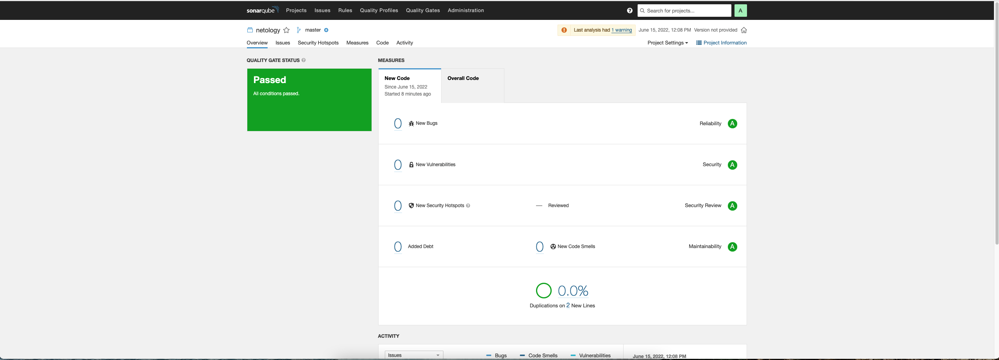

# Домашнее задание к занятию "09.02 CI\CD"

## SonarQube

## Nexus
~~~xml
<metadata modelVersion="1.1.0">
<groupId>netology</groupId>
<artifactId>java</artifactId>
<versioning>
<latest>8_282</latest>
<release>8_282</release>
<versions>
<version>8_102</version>
<version>8_282</version>
</versions>
<lastUpdated>20220615094216</lastUpdated>
</versioning>
</metadata>
~~~

## Maven

~~~xml
<project xmlns="http://maven.apache.org/POM/4.0.0" xmlns:xsi="http://www.w3.org/2001/XMLSchema-instance"
  xsi:schemaLocation="http://maven.apache.org/POM/4.0.0 http://maven.apache.org/xsd/maven-4.0.0.xsd">
  <modelVersion>4.0.0</modelVersion>

  <groupId>com.netology.app</groupId>
  <artifactId>simple-app</artifactId>
  <version>1.0-SNAPSHOT</version>
   <repositories>
    <repository>
      <id>my-repo</id>
      <name>maven-public</name>
      <url>http://localhost:8081/repository/maven-public/</url>
    </repository>
  </repositories>
  <dependencies>
     <dependency>
      <groupId>netology</groupId>
      <artifactId>java</artifactId>
      <version>8_282</version>
      <classifier>distrib</classifier>
      <type>tar.gz</type>
    </dependency>
  </dependencies>
</project>
~~~

~~~
rudnev@MN38-NB-OPIK5 mvn % pushd ~/.m2/repository/
~/.m2/repository ~/Documents/repo/mnt-homeworks/09-ci-02-cicd/mvn
rudnev@MN38-NB-OPIK5 repository % ls -l
total 0
drwxr-xr-x  3 rudnev  staff   96 15 июн 12:57 backport-util-concurrent
drwxr-xr-x  3 rudnev  staff   96 15 июн 12:57 classworlds
drwxr-xr-x  3 rudnev  staff   96 15 июн 12:57 com
drwxr-xr-x  3 rudnev  staff   96 15 июн 12:57 commons-cli
drwxr-xr-x  3 rudnev  staff   96 15 июн 12:57 commons-lang
drwxr-xr-x  3 rudnev  staff   96 15 июн 12:57 commons-logging
drwxr-xr-x  3 rudnev  staff   96 15 июн 12:57 junit
drwxr-xr-x  3 rudnev  staff   96 15 июн 12:57 log4j
drwxr-xr-x  3 rudnev  staff   96 15 июн 12:57 netology
drwxr-xr-x  6 rudnev  staff  192 15 июн 12:57 org
~~
