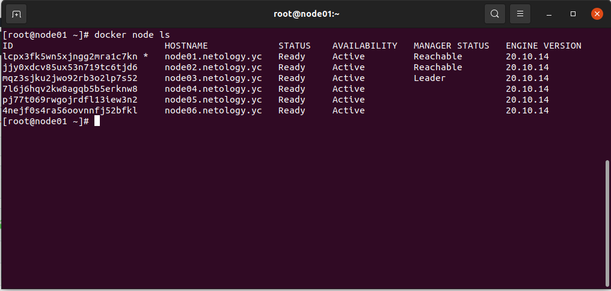

# Домашнее задание к занятию "5.5. Оркестрация кластером Docker контейнеров на примере Docker Swarm"

## Задача 1

### В чём отличие режимов работы сервисов в Docker Swarm кластере: replication и global?
- Для реплицированного сервиса вы указываете, сколько идентичных задач хотите запустить.
- Глобальный сервис — это сервис, который запускает одну задачу на каждой ноде.

### Какой алгоритм выбора лидера используется в Docker Swarm кластере?
- raft

### Что такое Overlay Network?
- Совместная работа двух наложенных друг на друга сетей, когда одна из них предоставляет услуги для другой

## Задача 2

```
[root@node01 ~]# docker node ls
ID                            HOSTNAME             STATUS    AVAILABILITY   MANAGER STATUS   ENGINE VERSION
lcpx3fk5wn5xjngg2mra1c7kn *   node01.netology.yc   Ready     Active         Reachable        20.10.14
jjy0xdcv85ux53n719tc6tjd6     node02.netology.yc   Ready     Active         Reachable        20.10.14
mqz3sjku2jwo92rb3o2lp7s52     node03.netology.yc   Ready     Active         Leader           20.10.14
7l6j6hqv2kw8agqb5b5erknw8     node04.netology.yc   Ready     Active                          20.10.14
pj77t069rwgojrdfl13iew3n2     node05.netology.yc   Ready     Active                          20.10.14
4nejf0s4ra56oovnnfj52bfkl     node06.netology.yc   Ready     Active                          20.10.14
```
<p align="center">
  
</p>

## Задача 3

```
docker service ls
ID             NAME                                MODE         REPLICAS   IMAGE                                          PORTS
sy2sp0tnmhwm   swarm_monitoring_alertmanager       replicated   1/1        stefanprodan/swarmprom-alertmanager:v0.14.0    
y8k8tyh3s6oe   swarm_monitoring_caddy              replicated   1/1        stefanprodan/caddy:latest                      *:3000->3000/tcp, *:9090->9090/tcp, *:9093-9094->9093-9094/tcp
lqrlzgg1nr37   swarm_monitoring_cadvisor           global       6/6        google/cadvisor:latest                         
yvumvk322t4i   swarm_monitoring_dockerd-exporter   global       6/6        stefanprodan/caddy:latest                      
kmi0adqo6gkq   swarm_monitoring_grafana            replicated   1/1        stefanprodan/swarmprom-grafana:5.3.4           
j699b5fguwuf   swarm_monitoring_node-exporter      global       6/6        stefanprodan/swarmprom-node-exporter:v0.16.0   
vp6yrg3i9h1p   swarm_monitoring_prometheus         replicated   1/1        stefanprodan/swarmprom-prometheus:v2.5.0       
jhzn1sce7wrn   swarm_monitoring_unsee              replicated   1/1        cloudflare/unsee:v0.8.0   
```

<p align="center">
  
</p>